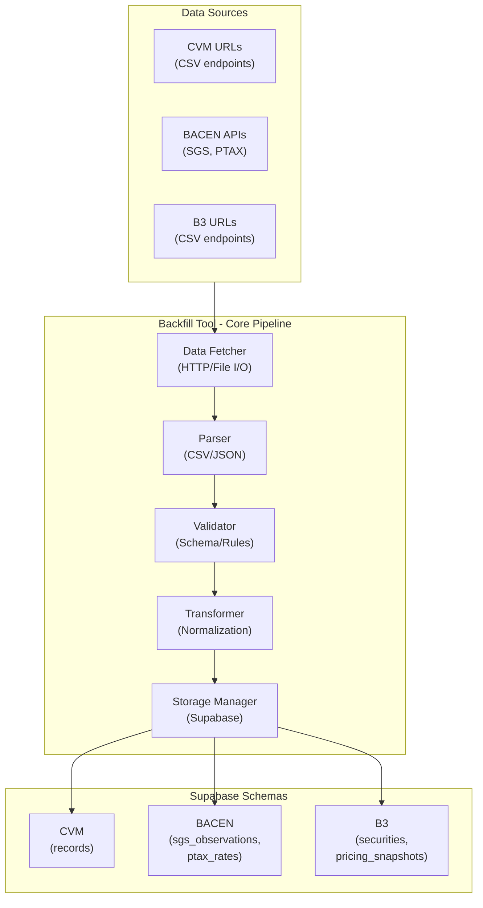
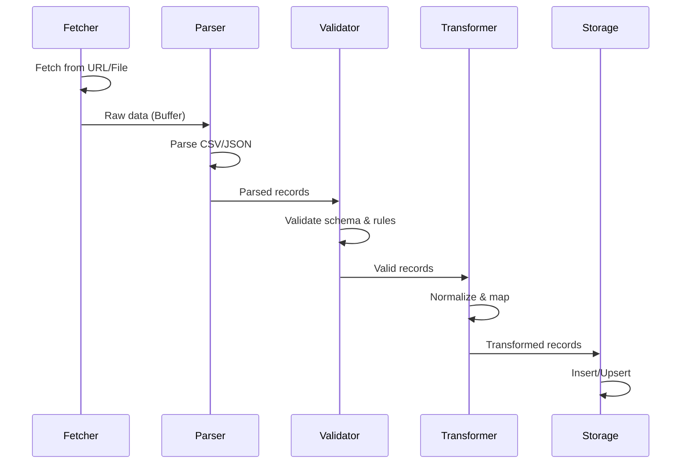

# Design Document: Supabase Daily Data Backfill Tool

## Overview

The Supabase Daily Data Backfill Tool is a data ingestion system that fetches financial data from external sources (URLs and CSV files) and stores it in Supabase across three isolated schemas: CVM, BACEN, and B3. The MVP focuses on core functionality: fetching data, parsing CSV/JSON, validating, transforming, and storing with basic error handling. The system operates on an append-only model where data is never deleted, only inserted or updated.

The tool bridges external data sources with the existing Supabase infrastructure, providing a reliable mechanism to populate and maintain three distinct financial datasets.

## Architecture



## Components and Interfaces

### 1. Data Fetcher

**Purpose**: Retrieves raw data from external sources (URLs, CSV files).

**Responsibilities**:
- Fetch data from HTTP endpoints
- Read local CSV files
- Handle authentication (API keys in headers)
- Manage connection timeouts
- Return raw data as Buffer

**Interface**:
```
interface DataFetcher {
  fetchFromURL(url: string, headers?: Record<string, string>): Promise<Buffer>
  fetchFromFile(path: string): Promise<Buffer>
}
```

### 2. Parser

**Purpose**: Converts raw data (CSV, JSON) into structured records.

**Responsibilities**:
- Parse CSV files with configurable delimiters
- Parse JSON responses from APIs
- Handle UTF-8 encoding
- Extract headers and map columns to fields
- Skip malformed rows

**Interface**:
```
interface Parser {
  parseCSV(buffer: Buffer, config: CSVConfig): Promise<Record[]>
  parseJSON(buffer: Buffer): Promise<Record[]>
}
```

### 3. Validator

**Purpose**: Ensures data conforms to schema and business rules.

**Responsibilities**:
- Check required fields presence
- Verify data types (string, number, date)
- Enforce business rules (CNPJ format, date ranges)
- Detect duplicates using unique keys
- Flag invalid records

**Interface**:
```
interface Validator {
  validateRecord(record: Record, schema: Schema): ValidationResult
  validateBatch(records: Record[], schema: Schema): ValidationResult[]
}
```

### 4. Transformer

**Purpose**: Normalizes and prepares data for storage.

**Responsibilities**:
- Map parsed fields to database columns
- Normalize dates to ISO 8601 format
- Normalize numeric values to appropriate precision
- Prepare JSONB payloads
- Detect insert vs. update operations

**Interface**:
```
interface Transformer {
  transformToCVMRecord(record: Record): CVMRecord
  transformToBAC ENData(record: Record): SGSObservation | PTAXRate
  transformToB3Data(record: Record): B3Security | B3PricingSnapshot
}
```

### 5. Storage Manager

**Purpose**: Handles database operations with append-only semantics.

**Responsibilities**:
- Insert new records
- Upsert existing records
- Manage transactions
- Handle schema-specific writes
- Enforce unique constraints

**Interface**:
```
interface StorageManager {
  insertCVMRecords(records: CVMRecord[]): Promise<InsertResult>
  upsertBAC ENData(records: (SGSObservation | PTAXRate)[]): Promise<UpsertResult>
  upsertB3Data(records: (B3Security | B3PricingSnapshot)[]): Promise<UpsertResult>
}
```

### 6. Error Handler

**Purpose**: Captures and handles errors with basic retry logic.

**Responsibilities**:
- Categorize errors (Network, Parsing, Validation, Storage)
- Implement exponential backoff retry (max 3 attempts)
- Log errors with context
- Skip invalid records and continue

**Interface**:
```
interface ErrorHandler {
  logError(error: BackfillError): void
  retryWithBackoff(fn: () => Promise<T>, maxRetries: number): Promise<T>
}
```

## Data Models

### CVM Service Data Model

**Source**: CVM CSV files (fund records, credit market data)

**Key Fields**:
- `entity`: Dataset identifier (e.g., "FIDC", "CREDIT_MARKET")
- `doc_type`: Document type (e.g., "mensal", "diario")
- `cnpj_key`: Fund CNPJ (14 digits, normalized)
- `competence_date`: Reporting period date
- `payload`: JSONB containing flexible CVM-specific fields

**Storage Table**: `cvm.records`

**Append-Only Logic**:
- New records: Insert with new (entity, doc_type, cnpj_key, competence_date) combination
- Updates: Insert new row with same key but updated payload (time-series history)
- Unique constraint: (entity, doc_type, cnpj_key, competence_date) prevents exact duplicates

### BACEN Service Data Model

**Source**: BACEN SGS API (time series) and PTAX API (exchange rates)

**SGS Observations**:
- `series_code`: SGS series identifier (integer)
- `obs_date`: Observation date
- `value`: Numeric value (nullable for missing observations)

**PTAX Rates**:
- `currency_code`: Currency code (e.g., "USD", "EUR")
- `rate_datetime`: Rate date
- `bid`: Bid rate
- `ask`: Ask rate

**Storage Tables**: `bacen.sgs_observations`, `bacen.ptax_rates`

**Append-Only Logic**:
- New observations: Insert if (series_code, obs_date) doesn't exist
- Updates: Upsert on (series_code, obs_date) to update value if new data available
- Unique constraint: (series_code, obs_date) and (currency_code, rate_datetime)

### B3 Service Data Model

**Source**: B3 CSV files (securities master data, pricing snapshots)

**B3 Securities**:
- `security_code`: Unique security identifier
- `security_type`: Type (debenture, CRA, CRI)
- `payload`: JSONB with security attributes

**B3 Pricing Snapshots**:
- `security_code`: Reference to security
- `snapshot_date`: Date of pricing snapshot
- `payload`: JSONB with pricing data (bid, ask, last price, etc.)

**Storage Tables**: `b3_calc.securities`, `b3_calc.pricing_snapshots`

**Append-Only Logic**:
- New securities: Insert if security_code doesn't exist
- New pricing: Insert if (security_code, snapshot_date) doesn't exist
- Updates: Upsert on (security_code, snapshot_date) to update pricing
- Unique constraint: security_code and (security_code, snapshot_date)

## Data Flow

### Backfill Pipeline



## Integration Points

### 1. Supabase Connection

- **Authentication**: Service role key for backend operations
- **Connection Pool**: Manage concurrent connections to three schemas
- **Isolation**: Each service writes only to its schema (cvm, bacen, b3_calc)
- **Transactions**: Atomic operations per service to ensure consistency

### 2. External Data Sources

**CVM**:
- HTTP endpoints returning CSV files
- Authentication: API key in headers (if required)
- Frequency: Daily updates

**BACEN**:
- SGS API: REST endpoint returning JSON time series
- PTAX API: REST endpoint returning exchange rates
- Authentication: Public API (no auth required)
- Frequency: Daily updates

**B3**:
- HTTP endpoints returning CSV files
- Authentication: API key or OAuth (if required)
- Frequency: Daily updates

### 3. Existing APIs

- **CVM API**: Existing endpoints for fund/credit market data
- **BACEN API**: Existing endpoints for SGS and PTAX data
- **B3 API**: Existing endpoints for securities and pricing data

The backfill tool complements these APIs by providing bulk historical data ingestion and daily refresh capabilities.

## Error Handling Strategy

### Error Categories

1. **Network Errors**: Connection timeouts, DNS failures, HTTP errors
   - Strategy: Exponential backoff retry (max 3 attempts)

2. **Parsing Errors**: Malformed CSV/JSON, encoding issues
   - Strategy: Log error, skip record, continue

3. **Validation Errors**: Missing fields, invalid formats, business rule violations
   - Strategy: Log error, skip record, flag for review

4. **Storage Errors**: Constraint violations, transaction failures
   - Strategy: Rollback transaction, retry batch (max 3 attempts)

### Retry Strategy

- **Exponential Backoff**: 1s, 2s, 4s, 8s
- **Max Retries**: 3 attempts per operation
- **Error Logging**: All errors logged with context (record, type, message)

## Monitoring & Observability

### Logging

- **Operation Log**: Backfill run start/end, records processed per service
- **Error Log**: All errors with context (record, error type, message, timestamp)
- **Format**: Structured JSON for easy querying

## Dependencies

### External Services

- **Supabase**: PostgreSQL database with three schemas (cvm, bacen, b3_calc)
- **CVM Data Source**: HTTP endpoint returning CSV
- **BACEN APIs**: SGS and PTAX REST endpoints returning JSON
- **B3 Data Source**: HTTP endpoint returning CSV

### Libraries & Frameworks

- **HTTP Client**: For fetching data from URLs (e.g., httpx, requests)
- **CSV Parser**: For parsing CSV files (e.g., csv module, pandas)
- **Database Driver**: Supabase client or SQLAlchemy ORM
- **Logging**: Structured logging (e.g., Python logging)

## Append-Only Semantics

### Core Principle

Data is never deleted, only appended or updated. This ensures:
- **Audit Trail**: Complete history of all data changes
- **Compliance**: Regulatory requirements for financial data retention
- **Recovery**: Ability to restore previous states if needed

### Implementation

1. **New Records**: Insert with unique key (service-specific)
2. **Updated Records**: Upsert on unique key to update payload/values
3. **Deleted Records**: Never physically deleted; mark as inactive if needed
4. **Historical Data**: All versions retained in database

### Unique Keys per Service

- **CVM**: (entity, doc_type, cnpj_key, competence_date)
- **BACEN SGS**: (series_code, obs_date)
- **BACEN PTAX**: (currency_code, rate_datetime)
- **B3 Securities**: (security_code)
- **B3 Pricing**: (security_code, snapshot_date)

## Performance Considerations

### Scalability

- **Batch Processing**: Process records in batches (1000 records per transaction)
- **Connection Pooling**: Reuse database connections
- **Bulk Operations**: Use batch insert/upsert for better throughput

### Optimization

- **Indexing**: Leverage existing indexes on unique key fields
- **Bulk Inserts**: Use batch operations instead of individual records
- **Incremental Backfill**: Only fetch data since last successful run (if source supports)

## Security Considerations

### Data Protection

- **Encryption in Transit**: HTTPS for all external API calls
- **Secrets Management**: Store API keys in environment variables (not in code)
- **No Credential Logging**: Never log API keys or sensitive data

### Authentication

- **Service Role Key**: Use Supabase service role for backend operations
- **API Keys**: Securely store external API keys in environment variables
